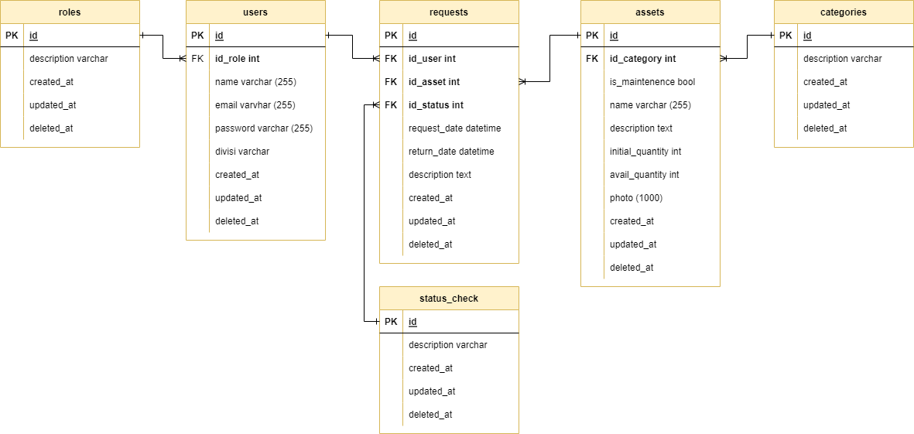

<!-- ABOUT THE PROJECT -->
## 💻 &nbsp;About The Project
E-Assets merupakan suatu project Capstone untuk membangun sebuah Rest API Employee Assets Management App menggunakan Golang. App ini menjadi sebuah wadah bagi employee perusahaan untuk melakukan pengajuan peminjaman asset perusahaan. 

### Features
- Employee
    - Login/Logout
    - Melihat semua aset perusahaan
    - Melihat aset perusahaan berdasarkan kategori dan/atau ketersediaan barang
    - Mengajukan perminataan peminjaman aset
    - Mengembalikan aset
    - Melihat histori peminjaman aset
    - Melihat status peminjaman aset
- Admin
    - Login/Logout
    - Menambah aset baru
    - Mengupdate aset perusahaan
    - Melihat dan/atau mengupdate status peminjaman aset
    - Melihat permintaan peminjaman aset berdasarkan kategori aset, status peminjaman, dan tanggal permintaan
    - Menyetujui dan menolak permintaan peminjaman aset
    - Meng-assign aset ke employee
- Manager
    - Login/Logout
    - Melihat list permintaan peminjaman aset berdasarkan tanggal permintaan dan/atau tanggal pengembalian
    - Melihat list permintaan peminjaman aset berdasarkan status peminjaman
    - Melakukan persetujuan/penolakan perminataan peminjaman

### &nbsp;Images
<details>
<summary>&nbsp;🖼 ERD</summary>

</details>

### 🕮 &nbsp;OpenAPI Documentation

See documentation [here](https://app.swaggerhub.com/apis-docs/RyanAdiW/Employee-Assets-Management/1.0.0).

### 🛠 &nbsp;Built With

&nbsp;
&nbsp;
&nbsp;
&nbsp;
&nbsp;
&nbsp;
&nbsp;
&nbsp;

## How to Use
### * Running on Local Server
- Install Golang, Postman, MySQL Management System (ex. MySQL Workbench)
- Clone repository with HTTPS:
```
git clone https://github.com/RyanAdiW/group4-capstone-project.git
```
* Create File `.env`:
```
export DB_USERNAME=[username db]
export DB_PASSWORD=[password db]
export DB_ADDRESS=[ip addres db]
export DB_NAME=[name db]
export S3_REGION=[S3 region]
export S3_KEY_ID=[S3 key id]
export S3_ACCESS_KEY=[S3 access key]
export S3_BUCKET_NAME=[S3 bucket name]
```
* Run `main.go` on local terminal
```
$ source .env && go run app/main.go
```
* Run the endpoint according to the OpenAPI Documentation (Swagger) via Postman 

<!-- CONTACT -->
## 📮 &nbsp;Contact

[](https://github.com/ryanadiw)
[](https://github.com/hilmihi)

<p align="center">:copyright: 2022</p>
</h3>